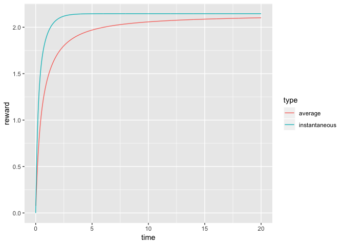

# RMarkov

RMarkov is a package for computing steady-state and transient solutions
of Markov chaings. Mainly, the package offers the computation funcsions
for continuous-time Markov chian (CTMC).

## Installation

You can install Rsrat from github with:

``` r
install.packages("devtools")
devtools::install_github("okamumu/RMarkov")
```

Load the library. This package requires Matrix and deformula packages.

``` r
library(RMarkov)
#> Loading required package: Matrix
```

## Steady-state analysis

### Steady-state solution of CTMC

Let’s consider a CTMC with the following infinitesimal generator:

``` r
Q <- rbind(
  c(-5,2,3,0,0),
  c(1,-4,3,0,0),
  c(0,2,-3,1,0),
  c(0,0,1,-2,1),
  c(0,0,1,4,-5)
)
```

Get the steady-state solution with GTH algorithm. This is efficient to
obtain the steady-state solution of a small-sized CTMC.

``` r
ctmc.st.gth(Q)
#> [1] 0.04166667 0.20833333 0.37500000 0.31250000 0.06250000
```

Get the steady-state solution with GS algorithm. This is used when the
CTMC is larege. Note that the matrix Q should be `CsparseMatrix
(dgCMatrix)` or `dgeMatrix` when we apply `ctmc.st.gs`.

``` r
ctmc.st.gs(Q)
#> $x
#> [1] 0.04166667 0.20833333 0.37500000 0.31250000 0.06250000
#> 
#> $convergence
#> [1] TRUE
#> 
#> $iter
#> [1] 100
#> 
#> $rerror
#> [1] 0
```

### Sensitivity function of steady-state solution

The sensitivity function or high-ordered sensitivity function are
defined by the first or higher derivatives of the steady-state solution.
Now we have the first derivative of Q with respect to a parameter:

``` r
dQ <- rbind(
  c(-1,1,0,0,0),
  c(0,-1,1,0,0),
  c(0,0,-1,1,0),
  c(0,0,0,-1,1),
  c(0,0,0,0,0)
)
```

Get the sensitivity function (the first derivative of steady-state
probability)

``` r
pis <- ctmc.st.gth(Q)
ctmc.stsen.gs(Q, pis, pis %*% dQ)
#> $x
#> [1] -0.03125000 -0.11458333 -0.11458333  0.16493056  0.09548611
#> 
#> $convergence
#> [1] TRUE
#> 
#> $iter
#> [1] 30
#> 
#> $rerror
#> [1] 6.231162e-10
```

### Quasi-stationary solution

If the underlying CTMC has absorbing states, limiting probabilities go
to any of absorbing states. The quasi stationary solution is a
probability vector provided that the state does not go to absorbing
states even if time goes to infinity.

Let T be the infinitesimal generator over transient states for the CTMC
with absorbing states.

``` r
T <- rbind(
  c(-5,2,0,0,0),
  c(1,-4,3,0,0),
  c(0,2,-3,1,0),
  c(0,0,1,-2,1),
  c(0,0,0,4,-5)
)
```

The quasi stationary can be obtained by power method

``` r
res <- ctmc.st.power(T)
print(res)
#> $x
#> [1] 0.04155506 0.19958042 0.33792657 0.34839739 0.07254056
#> 
#> $convergence
#> [1] TRUE
#> 
#> $iter
#> [1] 100
#> 
#> $rerror
#> [1] 1.714568e-09
```

## Transient analysis

### Probability vector

Let’s consider the same CTMC.

``` r
Q <- rbind(
  c(-5,2,3,0,0),
  c(1,-4,3,0,0),
  c(0,2,-3,1,0),
  c(0,0,1,-2,1),
  c(0,0,1,4,-5)
)
```

The initial probability vector is given by

``` r
x0 <- c(1,0,0,0,0)
```

Get the transient solution with uniformization.

``` r
ctmc.tran.unif(Q=Q, x=x0, t=seq(0,1,length.out = 10))
#> $t
#>  [1] 0.0000000 0.1111111 0.2222222 0.3333333 0.4444444 0.5555556 0.6666667
#>  [8] 0.7777778 0.8888889 1.0000000
#> 
#> $x
#>      [,1]         [,2]        [,3]        [,4]       [,5]       [,6]
#> [1,]    1 0.5820320616 0.351767424 0.224120901 0.15267248 0.11209328
#> [2,]    0 0.1612303811 0.239958487 0.274718187 0.28654935 0.28685532
#> [3,]    0 0.2423275279 0.362692298 0.418828974 0.44163544 0.44757632
#> [4,]    0 0.0139280733 0.042827224 0.075580246 0.10733132 0.13618174
#> [5,]    0 0.0004819562 0.002754567 0.006751692 0.01181142 0.01729334
#>            [,7]       [,8]       [,9]      [,10]
#> [1,] 0.08855444 0.07449601 0.06577544 0.06011389
#> [2,] 0.28175017 0.27445765 0.26663160 0.25908038
#> [3,] 0.44536423 0.43955706 0.43249361 0.42533392
#> [4,] 0.16159219 0.18361870 0.20255314 0.21875846
#> [5,] 0.02273898 0.02787058 0.03254621 0.03671335
#> 
#> $cx
#>      [,1]         [,2]        [,3]         [,4]        [,5]        [,6]
#> [1,]    0 8.558877e-02 0.136208683 0.1675142740 0.188069810 0.202571204
#> [2,]    0 9.975905e-03 0.032810841 0.0616922710 0.093021529 0.124949303
#> [3,]    0 1.497823e-02 0.049392243 0.0932293617 0.141247921 0.190755061
#> [4,]    0 5.538287e-04 0.003634472 0.0102064685 0.020389554 0.033948876
#> [5,]    0 1.437449e-05 0.000175981 0.0006909552 0.001715627 0.003331107
#>            [,7]        [,8]       [,9]      [,10]
#> [1,] 0.21360314 0.222597057 0.23035331 0.23732592
#> [2,] 0.15657016 0.187481292 0.21754199 0.24674347
#> [3,] 0.24041226 0.289594353 0.33804647 0.38570121
#> [4,] 0.05052408 0.069732655 0.09121363 0.11464339
#> [5,] 0.00555702 0.008372415 0.01173349 0.01558601
```

The reward vector is

``` r
r <- c(0,1,2,3,4)
```

``` r
res <- ctmc.tran.rwd.unif(Q=Q, x=x0, t=seq(0,20,length.out = 1000), r=r)
data <- data.frame(time=res$t, instantaneous=res$irwd, average=res$crwd / res$t)
head(data, 10)
#>          time instantaneous    average
#> 1  0.00000000     0.0000000        NaN
#> 2  0.02002002     0.1526178 0.07754355
#> 3  0.04004004     0.2911853 0.15027698
#> 4  0.06006006     0.4171316 0.21856957
#> 5  0.08008008     0.5317360 0.28275950
#> 6  0.10010010     0.6361436 0.34315661
#> 7  0.12012012     0.7313799 0.40004488
#> 8  0.14014014     0.8183633 0.45368471
#> 9  0.16016016     0.8979160 0.50431499
#> 10 0.18018018     0.9707750 0.55215496
```

``` r
library(ggplot2)
data_long <- tidyr::gather(data, key="type", value=reward, -time)
ggplot(data=data_long, aes(x=time, y=reward, colour=type)) + geom_line()
#> Warning: Removed 1 rows containing missing values (geom_path).
```



### Sensitivity for transient solution

As similar to the previous section, we have the first derivative of Q
with respect to a parameter:

``` r
dQ <- rbind(
  c(-1,1,0,0,0),
  c(0,-1,1,0,0),
  c(0,0,-1,1,0),
  c(0,0,0,-1,1),
  c(0,0,0,0,0)
)
```

The sensitivity function of transient solution can be obtained from the
following expanded infinitesimal generator.

``` r
Qdash <- rbind2(cbind2(Q, dQ), cbind2(RMarkov::zeroM(5), Q))
x0dash <- c(x0, rep(0,5))
rdash <- c(rep(0,5), r)
res <- ctmc.tran.rwd.unif(Q=Qdash, x=x0dash, t=seq(0,20,length.out = 1000), r=rdash)
print(res)
#> $t
#>    [1]  0.00000000  0.02002002  0.04004004  0.06006006  0.08008008
#>    [6]  0.10010010  0.12012012  0.14014014  0.16016016  0.18018018
#>   [11]  0.20020020  0.22022022  0.24024024  0.26026026  0.28028028
#>   [16]  0.30030030  0.32032032  0.34034034  0.36036036  0.38038038
#>   [21]  0.40040040  0.42042042  0.44044044  0.46046046  0.48048048
#>   [26]  0.50050050  0.52052052  0.54054054  0.56056056  0.58058058
#>   [31]  0.60060060  0.62062062  0.64064064  0.66066066  0.68068068
#>   [36]  0.70070070  0.72072072  0.74074074  0.76076076  0.78078078
#>   [41]  0.80080080  0.82082082  0.84084084  0.86086086  0.88088088
#>   [46]  0.90090090  0.92092092  0.94094094  0.96096096  0.98098098
#>   [51]  1.00100100  1.02102102  1.04104104  1.06106106  1.08108108
#>   [56]  1.10110110  1.12112112  1.14114114  1.16116116  1.18118118
#>   [61]  1.20120120  1.22122122  1.24124124  1.26126126  1.28128128
#>   [66]  1.30130130  1.32132132  1.34134134  1.36136136  1.38138138
#>   [71]  1.40140140  1.42142142  1.44144144  1.46146146  1.48148148
#>   [76]  1.50150150  1.52152152  1.54154154  1.56156156  1.58158158
#>   [81]  1.60160160  1.62162162  1.64164164  1.66166166  1.68168168
#>   [86]  1.70170170  1.72172172  1.74174174  1.76176176  1.78178178
#>   [91]  1.80180180  1.82182182  1.84184184  1.86186186  1.88188188
#>   [96]  1.90190190  1.92192192  1.94194194  1.96196196  1.98198198
#>  [101]  2.00200200  2.02202202  2.04204204  2.06206206  2.08208208
#>  [106]  2.10210210  2.12212212  2.14214214  2.16216216  2.18218218
#>  [111]  2.20220220  2.22222222  2.24224224  2.26226226  2.28228228
#>  [116]  2.30230230  2.32232232  2.34234234  2.36236236  2.38238238
#>  [121]  2.40240240  2.42242242  2.44244244  2.46246246  2.48248248
#>  [126]  2.50250250  2.52252252  2.54254254  2.56256256  2.58258258
#>  [131]  2.60260260  2.62262262  2.64264264  2.66266266  2.68268268
#>  [136]  2.70270270  2.72272272  2.74274274  2.76276276  2.78278278
#>  [141]  2.80280280  2.82282282  2.84284284  2.86286286  2.88288288
#>  [146]  2.90290290  2.92292292  2.94294294  2.96296296  2.98298298
#>  [151]  3.00300300  3.02302302  3.04304304  3.06306306  3.08308308
#>  [156]  3.10310310  3.12312312  3.14314314  3.16316316  3.18318318
#>  [161]  3.20320320  3.22322322  3.24324324  3.26326326  3.28328328
#>  [166]  3.30330330  3.32332332  3.34334334  3.36336336  3.38338338
#>  [171]  3.40340340  3.42342342  3.44344344  3.46346346  3.48348348
#>  [176]  3.50350350  3.52352352  3.54354354  3.56356356  3.58358358
#>  [181]  3.60360360  3.62362362  3.64364364  3.66366366  3.68368368
#>  [186]  3.70370370  3.72372372  3.74374374  3.76376376  3.78378378
#>  [191]  3.80380380  3.82382382  3.84384384  3.86386386  3.88388388
#>  [196]  3.90390390  3.92392392  3.94394394  3.96396396  3.98398398
#>  [201]  4.00400400  4.02402402  4.04404404  4.06406406  4.08408408
#>  [206]  4.10410410  4.12412412  4.14414414  4.16416416  4.18418418
#>  [211]  4.20420420  4.22422422  4.24424424  4.26426426  4.28428428
#>  [216]  4.30430430  4.32432432  4.34434434  4.36436436  4.38438438
#>  [221]  4.40440440  4.42442442  4.44444444  4.46446446  4.48448448
#>  [226]  4.50450450  4.52452452  4.54454454  4.56456456  4.58458458
#>  [231]  4.60460460  4.62462462  4.64464464  4.66466466  4.68468468
#>  [236]  4.70470470  4.72472472  4.74474474  4.76476476  4.78478478
#>  [241]  4.80480480  4.82482482  4.84484484  4.86486486  4.88488488
#>  [246]  4.90490490  4.92492492  4.94494494  4.96496496  4.98498498
#>  [251]  5.00500501  5.02502503  5.04504505  5.06506507  5.08508509
#>  [256]  5.10510511  5.12512513  5.14514515  5.16516517  5.18518519
#>  [261]  5.20520521  5.22522523  5.24524525  5.26526527  5.28528529
#>  [266]  5.30530531  5.32532533  5.34534535  5.36536537  5.38538539
#>  [271]  5.40540541  5.42542543  5.44544545  5.46546547  5.48548549
#>  [276]  5.50550551  5.52552553  5.54554555  5.56556557  5.58558559
#>  [281]  5.60560561  5.62562563  5.64564565  5.66566567  5.68568569
#>  [286]  5.70570571  5.72572573  5.74574575  5.76576577  5.78578579
#>  [291]  5.80580581  5.82582583  5.84584585  5.86586587  5.88588589
#>  [296]  5.90590591  5.92592593  5.94594595  5.96596597  5.98598599
#>  [301]  6.00600601  6.02602603  6.04604605  6.06606607  6.08608609
#>  [306]  6.10610611  6.12612613  6.14614615  6.16616617  6.18618619
#>  [311]  6.20620621  6.22622623  6.24624625  6.26626627  6.28628629
#>  [316]  6.30630631  6.32632633  6.34634635  6.36636637  6.38638639
#>  [321]  6.40640641  6.42642643  6.44644645  6.46646647  6.48648649
#>  [326]  6.50650651  6.52652653  6.54654655  6.56656657  6.58658659
#>  [331]  6.60660661  6.62662663  6.64664665  6.66666667  6.68668669
#>  [336]  6.70670671  6.72672673  6.74674675  6.76676677  6.78678679
#>  [341]  6.80680681  6.82682683  6.84684685  6.86686687  6.88688689
#>  [346]  6.90690691  6.92692693  6.94694695  6.96696697  6.98698699
#>  [351]  7.00700701  7.02702703  7.04704705  7.06706707  7.08708709
#>  [356]  7.10710711  7.12712713  7.14714715  7.16716717  7.18718719
#>  [361]  7.20720721  7.22722723  7.24724725  7.26726727  7.28728729
#>  [366]  7.30730731  7.32732733  7.34734735  7.36736737  7.38738739
#>  [371]  7.40740741  7.42742743  7.44744745  7.46746747  7.48748749
#>  [376]  7.50750751  7.52752753  7.54754755  7.56756757  7.58758759
#>  [381]  7.60760761  7.62762763  7.64764765  7.66766767  7.68768769
#>  [386]  7.70770771  7.72772773  7.74774775  7.76776777  7.78778779
#>  [391]  7.80780781  7.82782783  7.84784785  7.86786787  7.88788789
#>  [396]  7.90790791  7.92792793  7.94794795  7.96796797  7.98798799
#>  [401]  8.00800801  8.02802803  8.04804805  8.06806807  8.08808809
#>  [406]  8.10810811  8.12812813  8.14814815  8.16816817  8.18818819
#>  [411]  8.20820821  8.22822823  8.24824825  8.26826827  8.28828829
#>  [416]  8.30830831  8.32832833  8.34834835  8.36836837  8.38838839
#>  [421]  8.40840841  8.42842843  8.44844845  8.46846847  8.48848849
#>  [426]  8.50850851  8.52852853  8.54854855  8.56856857  8.58858859
#>  [431]  8.60860861  8.62862863  8.64864865  8.66866867  8.68868869
#>  [436]  8.70870871  8.72872873  8.74874875  8.76876877  8.78878879
#>  [441]  8.80880881  8.82882883  8.84884885  8.86886887  8.88888889
#>  [446]  8.90890891  8.92892893  8.94894895  8.96896897  8.98898899
#>  [451]  9.00900901  9.02902903  9.04904905  9.06906907  9.08908909
#>  [456]  9.10910911  9.12912913  9.14914915  9.16916917  9.18918919
#>  [461]  9.20920921  9.22922923  9.24924925  9.26926927  9.28928929
#>  [466]  9.30930931  9.32932933  9.34934935  9.36936937  9.38938939
#>  [471]  9.40940941  9.42942943  9.44944945  9.46946947  9.48948949
#>  [476]  9.50950951  9.52952953  9.54954955  9.56956957  9.58958959
#>  [481]  9.60960961  9.62962963  9.64964965  9.66966967  9.68968969
#>  [486]  9.70970971  9.72972973  9.74974975  9.76976977  9.78978979
#>  [491]  9.80980981  9.82982983  9.84984985  9.86986987  9.88988989
#>  [496]  9.90990991  9.92992993  9.94994995  9.96996997  9.98998999
#>  [501] 10.01001001 10.03003003 10.05005005 10.07007007 10.09009009
#>  [506] 10.11011011 10.13013013 10.15015015 10.17017017 10.19019019
#>  [511] 10.21021021 10.23023023 10.25025025 10.27027027 10.29029029
#>  [516] 10.31031031 10.33033033 10.35035035 10.37037037 10.39039039
#>  [521] 10.41041041 10.43043043 10.45045045 10.47047047 10.49049049
#>  [526] 10.51051051 10.53053053 10.55055055 10.57057057 10.59059059
#>  [531] 10.61061061 10.63063063 10.65065065 10.67067067 10.69069069
#>  [536] 10.71071071 10.73073073 10.75075075 10.77077077 10.79079079
#>  [541] 10.81081081 10.83083083 10.85085085 10.87087087 10.89089089
#>  [546] 10.91091091 10.93093093 10.95095095 10.97097097 10.99099099
#>  [551] 11.01101101 11.03103103 11.05105105 11.07107107 11.09109109
#>  [556] 11.11111111 11.13113113 11.15115115 11.17117117 11.19119119
#>  [561] 11.21121121 11.23123123 11.25125125 11.27127127 11.29129129
#>  [566] 11.31131131 11.33133133 11.35135135 11.37137137 11.39139139
#>  [571] 11.41141141 11.43143143 11.45145145 11.47147147 11.49149149
#>  [576] 11.51151151 11.53153153 11.55155155 11.57157157 11.59159159
#>  [581] 11.61161161 11.63163163 11.65165165 11.67167167 11.69169169
#>  [586] 11.71171171 11.73173173 11.75175175 11.77177177 11.79179179
#>  [591] 11.81181181 11.83183183 11.85185185 11.87187187 11.89189189
#>  [596] 11.91191191 11.93193193 11.95195195 11.97197197 11.99199199
#>  [601] 12.01201201 12.03203203 12.05205205 12.07207207 12.09209209
#>  [606] 12.11211211 12.13213213 12.15215215 12.17217217 12.19219219
#>  [611] 12.21221221 12.23223223 12.25225225 12.27227227 12.29229229
#>  [616] 12.31231231 12.33233233 12.35235235 12.37237237 12.39239239
#>  [621] 12.41241241 12.43243243 12.45245245 12.47247247 12.49249249
#>  [626] 12.51251251 12.53253253 12.55255255 12.57257257 12.59259259
#>  [631] 12.61261261 12.63263263 12.65265265 12.67267267 12.69269269
#>  [636] 12.71271271 12.73273273 12.75275275 12.77277277 12.79279279
#>  [641] 12.81281281 12.83283283 12.85285285 12.87287287 12.89289289
#>  [646] 12.91291291 12.93293293 12.95295295 12.97297297 12.99299299
#>  [651] 13.01301301 13.03303303 13.05305305 13.07307307 13.09309309
#>  [656] 13.11311311 13.13313313 13.15315315 13.17317317 13.19319319
#>  [661] 13.21321321 13.23323323 13.25325325 13.27327327 13.29329329
#>  [666] 13.31331331 13.33333333 13.35335335 13.37337337 13.39339339
#>  [671] 13.41341341 13.43343343 13.45345345 13.47347347 13.49349349
#>  [676] 13.51351351 13.53353353 13.55355355 13.57357357 13.59359359
#>  [681] 13.61361361 13.63363363 13.65365365 13.67367367 13.69369369
#>  [686] 13.71371371 13.73373373 13.75375375 13.77377377 13.79379379
#>  [691] 13.81381381 13.83383383 13.85385385 13.87387387 13.89389389
#>  [696] 13.91391391 13.93393393 13.95395395 13.97397397 13.99399399
#>  [701] 14.01401401 14.03403403 14.05405405 14.07407407 14.09409409
#>  [706] 14.11411411 14.13413413 14.15415415 14.17417417 14.19419419
#>  [711] 14.21421421 14.23423423 14.25425425 14.27427427 14.29429429
#>  [716] 14.31431431 14.33433433 14.35435435 14.37437437 14.39439439
#>  [721] 14.41441441 14.43443443 14.45445445 14.47447447 14.49449449
#>  [726] 14.51451451 14.53453453 14.55455455 14.57457457 14.59459459
#>  [731] 14.61461461 14.63463463 14.65465465 14.67467467 14.69469469
#>  [736] 14.71471471 14.73473473 14.75475475 14.77477477 14.79479479
#>  [741] 14.81481481 14.83483483 14.85485485 14.87487487 14.89489489
#>  [746] 14.91491491 14.93493493 14.95495495 14.97497497 14.99499499
#>  [751] 15.01501502 15.03503504 15.05505506 15.07507508 15.09509510
#>  [756] 15.11511512 15.13513514 15.15515516 15.17517518 15.19519520
#>  [761] 15.21521522 15.23523524 15.25525526 15.27527528 15.29529530
#>  [766] 15.31531532 15.33533534 15.35535536 15.37537538 15.39539540
#>  [771] 15.41541542 15.43543544 15.45545546 15.47547548 15.49549550
#>  [776] 15.51551552 15.53553554 15.55555556 15.57557558 15.59559560
#>  [781] 15.61561562 15.63563564 15.65565566 15.67567568 15.69569570
#>  [786] 15.71571572 15.73573574 15.75575576 15.77577578 15.79579580
#>  [791] 15.81581582 15.83583584 15.85585586 15.87587588 15.89589590
#>  [796] 15.91591592 15.93593594 15.95595596 15.97597598 15.99599600
#>  [801] 16.01601602 16.03603604 16.05605606 16.07607608 16.09609610
#>  [806] 16.11611612 16.13613614 16.15615616 16.17617618 16.19619620
#>  [811] 16.21621622 16.23623624 16.25625626 16.27627628 16.29629630
#>  [816] 16.31631632 16.33633634 16.35635636 16.37637638 16.39639640
#>  [821] 16.41641642 16.43643644 16.45645646 16.47647648 16.49649650
#>  [826] 16.51651652 16.53653654 16.55655656 16.57657658 16.59659660
#>  [831] 16.61661662 16.63663664 16.65665666 16.67667668 16.69669670
#>  [836] 16.71671672 16.73673674 16.75675676 16.77677678 16.79679680
#>  [841] 16.81681682 16.83683684 16.85685686 16.87687688 16.89689690
#>  [846] 16.91691692 16.93693694 16.95695696 16.97697698 16.99699700
#>  [851] 17.01701702 17.03703704 17.05705706 17.07707708 17.09709710
#>  [856] 17.11711712 17.13713714 17.15715716 17.17717718 17.19719720
#>  [861] 17.21721722 17.23723724 17.25725726 17.27727728 17.29729730
#>  [866] 17.31731732 17.33733734 17.35735736 17.37737738 17.39739740
#>  [871] 17.41741742 17.43743744 17.45745746 17.47747748 17.49749750
#>  [876] 17.51751752 17.53753754 17.55755756 17.57757758 17.59759760
#>  [881] 17.61761762 17.63763764 17.65765766 17.67767768 17.69769770
#>  [886] 17.71771772 17.73773774 17.75775776 17.77777778 17.79779780
#>  [891] 17.81781782 17.83783784 17.85785786 17.87787788 17.89789790
#>  [896] 17.91791792 17.93793794 17.95795796 17.97797798 17.99799800
#>  [901] 18.01801802 18.03803804 18.05805806 18.07807808 18.09809810
#>  [906] 18.11811812 18.13813814 18.15815816 18.17817818 18.19819820
#>  [911] 18.21821822 18.23823824 18.25825826 18.27827828 18.29829830
#>  [916] 18.31831832 18.33833834 18.35835836 18.37837838 18.39839840
#>  [921] 18.41841842 18.43843844 18.45845846 18.47847848 18.49849850
#>  [926] 18.51851852 18.53853854 18.55855856 18.57857858 18.59859860
#>  [931] 18.61861862 18.63863864 18.65865866 18.67867868 18.69869870
#>  [936] 18.71871872 18.73873874 18.75875876 18.77877878 18.79879880
#>  [941] 18.81881882 18.83883884 18.85885886 18.87887888 18.89889890
#>  [946] 18.91891892 18.93893894 18.95895896 18.97897898 18.99899900
#>  [951] 19.01901902 19.03903904 19.05905906 19.07907908 19.09909910
#>  [956] 19.11911912 19.13913914 19.15915916 19.17917918 19.19919920
#>  [961] 19.21921922 19.23923924 19.25925926 19.27927928 19.29929930
#>  [966] 19.31931932 19.33933934 19.35935936 19.37937938 19.39939940
#>  [971] 19.41941942 19.43943944 19.45945946 19.47947948 19.49949950
#>  [976] 19.51951952 19.53953954 19.55955956 19.57957958 19.59959960
#>  [981] 19.61961962 19.63963964 19.65965966 19.67967968 19.69969970
#>  [986] 19.71971972 19.73973974 19.75975976 19.77977978 19.79979980
#>  [991] 19.81981982 19.83983984 19.85985986 19.87987988 19.89989990
#>  [996] 19.91991992 19.93993994 19.95995996 19.97997998 20.00000000
#> 
#> $x
#>  [1]  0.04166667  0.20833333  0.37500000  0.31250000  0.06250000
#>  [6] -0.03125000 -0.11458333 -0.11458333  0.16493056  0.09548611
#> 
#> $cx
#>  [1]  1.0399306  4.2413194  7.5468750  5.9869792  1.1848958 -0.6423611
#>  [7] -2.2031250 -2.2204861  3.2397280  1.8262442
#> 
#> $irwd
#>    [1] 0.00000000 0.01889809 0.03584589 0.05122592 0.06535314 0.07848544
#>    [7] 0.09083263 0.10256414 0.11381561 0.12469446 0.13528472 0.14565104
#>   [13] 0.15584217 0.16589384 0.17583122 0.18567102 0.19542318 0.20509233
#>   [19] 0.21467901 0.22418068 0.23359247 0.24290797 0.25211966 0.26121943
#>   [25] 0.27019892 0.27904977 0.28776385 0.29633345 0.30475136 0.31301097
#>   [31] 0.32110634 0.32903221 0.33678405 0.34435802 0.35175096 0.35896042
#>   [37] 0.36598457 0.37282220 0.37947266 0.38593587 0.39221221 0.39830256
#>   [43] 0.40420817 0.40993070 0.41547216 0.42083483 0.42602130 0.43103436
#>   [49] 0.43587705 0.44055255 0.44506421 0.44941552 0.45361004 0.45765145
#>   [55] 0.46154347 0.46528987 0.46889447 0.47236107 0.47569350 0.47889558
#>   [61] 0.48197109 0.48492381 0.48775746 0.49047573 0.49308225 0.49558060
#>   [67] 0.49797429 0.50026679 0.50246146 0.50456164 0.50657055 0.50849136
#>   [73] 0.51032717 0.51208099 0.51375574 0.51535430 0.51687944 0.51833386
#>   [79] 0.51972018 0.52104096 0.52229866 0.52349568 0.52463435 0.52571692
#>   [85] 0.52674557 0.52772240 0.52864946 0.52952871 0.53036208 0.53115140
#>   [91] 0.53189846 0.53260496 0.53327259 0.53390293 0.53449754 0.53505791
#>   [97] 0.53558548 0.53608163 0.53654771 0.53698499 0.53739473 0.53777813
#>  [103] 0.53813632 0.53847043 0.53878152 0.53907061 0.53933870 0.53958674
#>  [109] 0.53981564 0.54002628 0.54021952 0.54039615 0.54055698 0.54070273
#>  [115] 0.54083415 0.54095191 0.54105670 0.54114914 0.54122985 0.54129942
#>  [121] 0.54135841 0.54140737 0.54144682 0.54147726 0.54149916 0.54151299
#>  [127] 0.54151918 0.54151815 0.54151032 0.54149606 0.54147575 0.54144974
#>  [133] 0.54141837 0.54138196 0.54134083 0.54129527 0.54124558 0.54119200
#>  [139] 0.54113482 0.54107428 0.54101060 0.54094403 0.54087477 0.54080303
#>  [145] 0.54072901 0.54065289 0.54057486 0.54049508 0.54041371 0.54033092
#>  [151] 0.54024684 0.54016161 0.54007538 0.53998826 0.53990037 0.53981183
#>  [157] 0.53972274 0.53963322 0.53954334 0.53945322 0.53936292 0.53927255
#>  [163] 0.53918216 0.53909184 0.53900166 0.53891167 0.53882195 0.53873255
#>  [169] 0.53864351 0.53855491 0.53846677 0.53837915 0.53829209 0.53820563
#>  [175] 0.53811980 0.53803464 0.53795017 0.53786644 0.53778345 0.53770125
#>  [181] 0.53761984 0.53753926 0.53745952 0.53738064 0.53730263 0.53722551
#>  [187] 0.53714929 0.53707398 0.53699959 0.53692613 0.53685361 0.53678203
#>  [193] 0.53671139 0.53664171 0.53657298 0.53650521 0.53643840 0.53637254
#>  [199] 0.53630764 0.53624370 0.53618071 0.53611867 0.53605758 0.53599743
#>  [205] 0.53593822 0.53587995 0.53582261 0.53576619 0.53571069 0.53565610
#>  [211] 0.53560241 0.53554962 0.53549772 0.53544669 0.53539655 0.53534726
#>  [217] 0.53529883 0.53525125 0.53520451 0.53515859 0.53511350 0.53506921
#>  [223] 0.53502573 0.53498303 0.53494111 0.53489997 0.53485959 0.53481995
#>  [229] 0.53478106 0.53474289 0.53470545 0.53466872 0.53463269 0.53459734
#>  [235] 0.53456268 0.53452869 0.53449535 0.53446267 0.53443062 0.53439921
#>  [241] 0.53436841 0.53433823 0.53430864 0.53427964 0.53425123 0.53422338
#>  [247] 0.53419610 0.53416937 0.53414318 0.53411752 0.53409239 0.53406778
#>  [253] 0.53404367 0.53402005 0.53399693 0.53397428 0.53395211 0.53393040
#>  [259] 0.53390914 0.53388833 0.53386796 0.53384801 0.53382849 0.53380938
#>  [265] 0.53379068 0.53377238 0.53375447 0.53373694 0.53371978 0.53370300
#>  [271] 0.53368657 0.53367051 0.53365479 0.53363941 0.53362436 0.53360964
#>  [277] 0.53359525 0.53358117 0.53356739 0.53355392 0.53354075 0.53352787
#>  [283] 0.53351527 0.53350295 0.53349090 0.53347912 0.53346760 0.53345634
#>  [289] 0.53344533 0.53343457 0.53342405 0.53341376 0.53340370 0.53339388
#>  [295] 0.53338427 0.53337488 0.53336570 0.53335673 0.53334796 0.53333939
#>  [301] 0.53333102 0.53332284 0.53331484 0.53330703 0.53329939 0.53329193
#>  [307] 0.53328464 0.53327752 0.53327057 0.53326377 0.53325713 0.53325064
#>  [313] 0.53324430 0.53323811 0.53323206 0.53322616 0.53322039 0.53321475
#>  [319] 0.53320925 0.53320387 0.53319862 0.53319349 0.53318848 0.53318359
#>  [325] 0.53317882 0.53317415 0.53316960 0.53316515 0.53316080 0.53315656
#>  [331] 0.53315242 0.53314838 0.53314443 0.53314058 0.53313681 0.53313314
#>  [337] 0.53312955 0.53312605 0.53312263 0.53311930 0.53311604 0.53311286
#>  [343] 0.53310976 0.53310673 0.53310377 0.53310088 0.53309806 0.53309531
#>  [349] 0.53309263 0.53309001 0.53308745 0.53308496 0.53308252 0.53308014
#>  [355] 0.53307782 0.53307556 0.53307335 0.53307119 0.53306909 0.53306704
#>  [361] 0.53306503 0.53306308 0.53306117 0.53305931 0.53305750 0.53305572
#>  [367] 0.53305400 0.53305231 0.53305066 0.53304906 0.53304749 0.53304596
#>  [373] 0.53304447 0.53304302 0.53304160 0.53304022 0.53303886 0.53303755
#>  [379] 0.53303626 0.53303501 0.53303379 0.53303259 0.53303143 0.53303030
#>  [385] 0.53302919 0.53302811 0.53302706 0.53302603 0.53302503 0.53302405
#>  [391] 0.53302310 0.53302217 0.53302126 0.53302038 0.53301951 0.53301867
#>  [397] 0.53301785 0.53301705 0.53301627 0.53301551 0.53301477 0.53301405
#>  [403] 0.53301334 0.53301266 0.53301198 0.53301133 0.53301069 0.53301007
#>  [409] 0.53300946 0.53300887 0.53300830 0.53300773 0.53300719 0.53300665
#>  [415] 0.53300613 0.53300562 0.53300513 0.53300465 0.53300417 0.53300372
#>  [421] 0.53300327 0.53300283 0.53300241 0.53300199 0.53300159 0.53300119
#>  [427] 0.53300081 0.53300043 0.53300007 0.53299971 0.53299937 0.53299903
#>  [433] 0.53299870 0.53299838 0.53299806 0.53299776 0.53299746 0.53299717
#>  [439] 0.53299689 0.53299661 0.53299634 0.53299608 0.53299583 0.53299558
#>  [445] 0.53299534 0.53299510 0.53299487 0.53299464 0.53299442 0.53299421
#>  [451] 0.53299400 0.53299380 0.53299360 0.53299341 0.53299322 0.53299304
#>  [457] 0.53299286 0.53299269 0.53299252 0.53299235 0.53299219 0.53299204
#>  [463] 0.53299188 0.53299174 0.53299159 0.53299145 0.53299131 0.53299118
#>  [469] 0.53299105 0.53299092 0.53299080 0.53299067 0.53299056 0.53299044
#>  [475] 0.53299033 0.53299022 0.53299011 0.53299001 0.53298991 0.53298981
#>  [481] 0.53298972 0.53298962 0.53298953 0.53298944 0.53298936 0.53298927
#>  [487] 0.53298919 0.53298911 0.53298903 0.53298896 0.53298888 0.53298881
#>  [493] 0.53298874 0.53298867 0.53298861 0.53298854 0.53298848 0.53298842
#>  [499] 0.53298836 0.53298830 0.53298824 0.53298819 0.53298813 0.53298808
#>  [505] 0.53298803 0.53298798 0.53298793 0.53298788 0.53298784 0.53298779
#>  [511] 0.53298775 0.53298771 0.53298766 0.53298762 0.53298758 0.53298755
#>  [517] 0.53298751 0.53298747 0.53298744 0.53298740 0.53298737 0.53298733
#>  [523] 0.53298730 0.53298727 0.53298724 0.53298721 0.53298718 0.53298716
#>  [529] 0.53298713 0.53298710 0.53298708 0.53298705 0.53298703 0.53298700
#>  [535] 0.53298698 0.53298696 0.53298693 0.53298691 0.53298689 0.53298687
#>  [541] 0.53298685 0.53298683 0.53298681 0.53298679 0.53298678 0.53298676
#>  [547] 0.53298674 0.53298673 0.53298671 0.53298669 0.53298668 0.53298666
#>  [553] 0.53298665 0.53298663 0.53298662 0.53298661 0.53298659 0.53298658
#>  [559] 0.53298657 0.53298656 0.53298655 0.53298653 0.53298652 0.53298651
#>  [565] 0.53298650 0.53298649 0.53298648 0.53298647 0.53298646 0.53298645
#>  [571] 0.53298644 0.53298643 0.53298643 0.53298642 0.53298641 0.53298640
#>  [577] 0.53298639 0.53298639 0.53298638 0.53298637 0.53298637 0.53298636
#>  [583] 0.53298635 0.53298635 0.53298634 0.53298633 0.53298633 0.53298632
#>  [589] 0.53298632 0.53298631 0.53298631 0.53298630 0.53298630 0.53298629
#>  [595] 0.53298629 0.53298628 0.53298628 0.53298627 0.53298627 0.53298626
#>  [601] 0.53298626 0.53298626 0.53298625 0.53298625 0.53298624 0.53298624
#>  [607] 0.53298624 0.53298623 0.53298623 0.53298623 0.53298622 0.53298622
#>  [613] 0.53298622 0.53298622 0.53298621 0.53298621 0.53298621 0.53298621
#>  [619] 0.53298620 0.53298620 0.53298620 0.53298620 0.53298619 0.53298619
#>  [625] 0.53298619 0.53298619 0.53298619 0.53298618 0.53298618 0.53298618
#>  [631] 0.53298618 0.53298618 0.53298617 0.53298617 0.53298617 0.53298617
#>  [637] 0.53298617 0.53298617 0.53298616 0.53298616 0.53298616 0.53298616
#>  [643] 0.53298616 0.53298616 0.53298616 0.53298616 0.53298615 0.53298615
#>  [649] 0.53298615 0.53298615 0.53298615 0.53298615 0.53298615 0.53298615
#>  [655] 0.53298615 0.53298614 0.53298614 0.53298614 0.53298614 0.53298614
#>  [661] 0.53298614 0.53298614 0.53298614 0.53298614 0.53298614 0.53298614
#>  [667] 0.53298614 0.53298614 0.53298613 0.53298613 0.53298613 0.53298613
#>  [673] 0.53298613 0.53298613 0.53298613 0.53298613 0.53298613 0.53298613
#>  [679] 0.53298613 0.53298613 0.53298613 0.53298613 0.53298613 0.53298613
#>  [685] 0.53298613 0.53298613 0.53298613 0.53298613 0.53298612 0.53298612
#>  [691] 0.53298612 0.53298612 0.53298612 0.53298612 0.53298612 0.53298612
#>  [697] 0.53298612 0.53298612 0.53298612 0.53298612 0.53298612 0.53298612
#>  [703] 0.53298612 0.53298612 0.53298612 0.53298612 0.53298612 0.53298612
#>  [709] 0.53298612 0.53298612 0.53298612 0.53298612 0.53298612 0.53298612
#>  [715] 0.53298612 0.53298612 0.53298612 0.53298612 0.53298612 0.53298612
#>  [721] 0.53298612 0.53298612 0.53298612 0.53298612 0.53298612 0.53298612
#>  [727] 0.53298612 0.53298612 0.53298612 0.53298612 0.53298612 0.53298612
#>  [733] 0.53298612 0.53298612 0.53298612 0.53298611 0.53298611 0.53298611
#>  [739] 0.53298611 0.53298611 0.53298611 0.53298611 0.53298611 0.53298611
#>  [745] 0.53298611 0.53298611 0.53298611 0.53298611 0.53298611 0.53298611
#>  [751] 0.53298611 0.53298611 0.53298611 0.53298611 0.53298611 0.53298611
#>  [757] 0.53298611 0.53298611 0.53298611 0.53298611 0.53298611 0.53298611
#>  [763] 0.53298611 0.53298611 0.53298611 0.53298611 0.53298611 0.53298611
#>  [769] 0.53298611 0.53298611 0.53298611 0.53298611 0.53298611 0.53298611
#>  [775] 0.53298611 0.53298611 0.53298611 0.53298611 0.53298611 0.53298611
#>  [781] 0.53298611 0.53298611 0.53298611 0.53298611 0.53298611 0.53298611
#>  [787] 0.53298611 0.53298611 0.53298611 0.53298611 0.53298611 0.53298611
#>  [793] 0.53298611 0.53298611 0.53298611 0.53298611 0.53298611 0.53298611
#>  [799] 0.53298611 0.53298611 0.53298611 0.53298611 0.53298611 0.53298611
#>  [805] 0.53298611 0.53298611 0.53298611 0.53298611 0.53298611 0.53298611
#>  [811] 0.53298611 0.53298611 0.53298611 0.53298611 0.53298611 0.53298611
#>  [817] 0.53298611 0.53298611 0.53298611 0.53298611 0.53298611 0.53298611
#>  [823] 0.53298611 0.53298611 0.53298611 0.53298611 0.53298611 0.53298611
#>  [829] 0.53298611 0.53298611 0.53298611 0.53298611 0.53298611 0.53298611
#>  [835] 0.53298611 0.53298611 0.53298611 0.53298611 0.53298611 0.53298611
#>  [841] 0.53298611 0.53298611 0.53298611 0.53298611 0.53298611 0.53298611
#>  [847] 0.53298611 0.53298611 0.53298611 0.53298611 0.53298611 0.53298611
#>  [853] 0.53298611 0.53298611 0.53298611 0.53298611 0.53298611 0.53298611
#>  [859] 0.53298611 0.53298611 0.53298611 0.53298611 0.53298611 0.53298611
#>  [865] 0.53298611 0.53298611 0.53298611 0.53298611 0.53298611 0.53298611
#>  [871] 0.53298611 0.53298611 0.53298611 0.53298611 0.53298611 0.53298611
#>  [877] 0.53298611 0.53298611 0.53298611 0.53298611 0.53298611 0.53298611
#>  [883] 0.53298611 0.53298611 0.53298611 0.53298611 0.53298611 0.53298611
#>  [889] 0.53298611 0.53298611 0.53298611 0.53298611 0.53298611 0.53298611
#>  [895] 0.53298611 0.53298611 0.53298611 0.53298611 0.53298611 0.53298611
#>  [901] 0.53298611 0.53298611 0.53298611 0.53298611 0.53298611 0.53298611
#>  [907] 0.53298611 0.53298611 0.53298611 0.53298611 0.53298611 0.53298611
#>  [913] 0.53298611 0.53298611 0.53298611 0.53298611 0.53298611 0.53298611
#>  [919] 0.53298611 0.53298611 0.53298611 0.53298611 0.53298611 0.53298611
#>  [925] 0.53298611 0.53298611 0.53298611 0.53298611 0.53298611 0.53298611
#>  [931] 0.53298611 0.53298611 0.53298611 0.53298611 0.53298611 0.53298611
#>  [937] 0.53298611 0.53298611 0.53298611 0.53298611 0.53298611 0.53298611
#>  [943] 0.53298611 0.53298611 0.53298611 0.53298611 0.53298611 0.53298611
#>  [949] 0.53298611 0.53298611 0.53298611 0.53298611 0.53298611 0.53298611
#>  [955] 0.53298611 0.53298611 0.53298611 0.53298611 0.53298611 0.53298611
#>  [961] 0.53298611 0.53298611 0.53298611 0.53298611 0.53298611 0.53298611
#>  [967] 0.53298611 0.53298611 0.53298611 0.53298611 0.53298611 0.53298611
#>  [973] 0.53298611 0.53298611 0.53298611 0.53298611 0.53298611 0.53298611
#>  [979] 0.53298611 0.53298611 0.53298611 0.53298611 0.53298611 0.53298611
#>  [985] 0.53298611 0.53298611 0.53298611 0.53298611 0.53298611 0.53298611
#>  [991] 0.53298611 0.53298611 0.53298611 0.53298611 0.53298611 0.53298611
#>  [997] 0.53298611 0.53298611 0.53298611 0.53298611
#> 
#> $crwd
#>    [1]  0.000000000  0.000192783  0.000743683  0.001617607  0.002786423
#>    [6]  0.004227720  0.005923753  0.007860561  0.010027228  0.012415261
#>   [11]  0.015018078  0.017830576  0.020848785  0.024069574  0.027490420
#>   [16]  0.031109214  0.034924111  0.038933413  0.043135467  0.047528602
#>   [21]  0.052111071  0.056881011  0.061836423  0.066975146  0.072294856
#>   [26]  0.077793063  0.083467108  0.089314175  0.095331298  0.101515375
#>   [31]  0.107863174  0.114371354  0.121036475  0.127855014  0.134823376
#>   [36]  0.141937912  0.149194929  0.156590704  0.164121496  0.171783555
#>   [41]  0.179573136  0.187486506  0.195519954  0.203669796  0.211932387
#>   [46]  0.220304124  0.228781454  0.237360877  0.246038950  0.254812295
#>   [51]  0.263677599  0.272631614  0.281671168  0.290793157  0.299994553
#>   [56]  0.309272404  0.318623832  0.328046036  0.337536293  0.347091953
#>   [61]  0.356710446  0.366389275  0.376126020  0.385918334  0.395763942
#>   [66]  0.405660645  0.415606311  0.425598880  0.435636361  0.445716827
#>   [71]  0.455838420  0.465999344  0.476197867  0.486432317  0.496701082
#>   [76]  0.507002609  0.517335399  0.527698010  0.538089053  0.548507190
#>   [81]  0.558951133  0.569419644  0.579911532  0.590425650  0.600960898
#>   [86]  0.611516218  0.622090592  0.632683044  0.643292637  0.653918469
#>   [91]  0.664559678  0.675215434  0.685884943  0.696567441  0.707262199
#>   [96]  0.717968516  0.728685720  0.739413170  0.750150250  0.760896370
#>  [101]  0.771650966  0.782413500  0.793183456  0.803960340  0.814743680
#>  [106]  0.825533026  0.836327948  0.847128036  0.857932895  0.868742153
#>  [111]  0.879555453  0.890372454  0.901192831  0.912016276  0.922842495
#>  [116]  0.933671206  0.944502144  0.955335056  0.966169699  0.977005846
#>  [121]  0.987843279  0.998681791  1.009521188  1.020361283  1.031201902
#>  [126]  1.042042878  1.052884053  1.063725279  1.074566416  1.085407331
#>  [131]  1.096247899  1.107088003  1.117927533  1.128766383  1.139604456
#>  [136]  1.150441662  1.161277913  1.172113130  1.182947239  1.193780168
#>  [141]  1.204611853  1.215442235  1.226271256  1.237098865  1.247925016
#>  [146]  1.258749663  1.269572766  1.280394290  1.291214200  1.302032467
#>  [151]  1.312849063  1.323663965  1.334477149  1.345288598  1.356098295
#>  [156]  1.366906226  1.377712379  1.388516744  1.399319312  1.410120079
#>  [161]  1.420919039  1.431716191  1.442511534  1.453305067  1.464096793
#>  [166]  1.474886716  1.485674840  1.496461171  1.507245715  1.518028481
#>  [171]  1.528809478  1.539588716  1.550366205  1.561141957  1.571915984
#>  [176]  1.582688300  1.593458917  1.604227851  1.614995116  1.625760727
#>  [181]  1.636524701  1.647287053  1.658047800  1.668806959  1.679564548
#>  [186]  1.690320584  1.701075085  1.711828069  1.722579555  1.733329560
#>  [191]  1.744078105  1.754825206  1.765570885  1.776315158  1.787058047
#>  [196]  1.797799568  1.808539743  1.819278590  1.830016127  1.840752375
#>  [201]  1.851487353  1.862221079  1.872953572  1.883684852  1.894414937
#>  [206]  1.905143846  1.915871598  1.926598211  1.937323703  1.948048094
#>  [211]  1.958771401  1.969493642  1.980214835  1.990934998  2.001654148
#>  [216]  2.012372303  2.023089479  2.033805695  2.044520966  2.055235310
#>  [221]  2.065948743  2.076661282  2.087372941  2.098083739  2.108793689
#>  [226]  2.119502807  2.130211110  2.140918611  2.151625327  2.162331271
#>  [231]  2.173036459  2.183740904  2.194444620  2.205147622  2.215849924
#>  [236]  2.226551538  2.237252478  2.247952758  2.258652389  2.269351385
#>  [241]  2.280049759  2.290747522  2.301444687  2.312141265  2.322837269
#>  [246]  2.333532710  2.344227598  2.354921947  2.365615765  2.376309064
#>  [251]  2.387001855  2.397694149  2.408385954  2.419077282  2.429768141
#>  [256]  2.440458543  2.451148496  2.461838010  2.472527094  2.483215756
#>  [261]  2.493904007  2.504591854  2.515279306  2.525966371  2.536653057
#>  [266]  2.547339374  2.558025327  2.568710926  2.579396178  2.590081090
#>  [271]  2.600765670  2.611449924  2.622133861  2.632817486  2.643500806
#>  [276]  2.654183828  2.664866560  2.675549006  2.686231173  2.696913067
#>  [281]  2.707594695  2.718276062  2.728957174  2.739638037  2.750318656
#>  [286]  2.760999036  2.771679183  2.782359102  2.793038798  2.803718276
#>  [291]  2.814397541  2.825076597  2.835755450  2.846434105  2.857112564
#>  [296]  2.867790833  2.878468917  2.889146819  2.899824543  2.910502094
#>  [301]  2.921179475  2.931856690  2.942533744  2.953210639  2.963887380
#>  [306]  2.974563969  2.985240411  2.995916709  3.006592866  3.017268885
#>  [311]  3.027944769  3.038620522  3.049296147  3.059971647  3.070647024
#>  [316]  3.081322281  3.091997421  3.102672447  3.113347362  3.124022168
#>  [321]  3.134696867  3.145371463  3.156045957  3.166720352  3.177394650
#>  [326]  3.188068853  3.198742965  3.209416986  3.220090919  3.230764767
#>  [331]  3.241438530  3.252112212  3.262785813  3.273459337  3.284132784
#>  [336]  3.294806157  3.305479457  3.316152686  3.326825846  3.337498938
#>  [341]  3.348171964  3.358844926  3.369517825  3.380190663  3.390863440
#>  [346]  3.401536159  3.412208821  3.422881427  3.433553979  3.444226478
#>  [351]  3.454898925  3.465571321  3.476243668  3.486915967  3.497588219
#>  [356]  3.508260425  3.518932586  3.529604703  3.540276778  3.550948812
#>  [361]  3.561620804  3.572292757  3.582964672  3.593636548  3.604308388
#>  [366]  3.614980192  3.625651961  3.636323695  3.646995397  3.657667066
#>  [371]  3.668338703  3.679010309  3.689681885  3.700353431  3.711024949
#>  [376]  3.721696438  3.732367900  3.743039336  3.753710745  3.764382129
#>  [381]  3.775053489  3.785724824  3.796396135  3.807067424  3.817738690
#>  [386]  3.828409934  3.839081157  3.849752359  3.860423540  3.871094702
#>  [391]  3.881765845  3.892436968  3.903108074  3.913779161  3.924450231
#>  [396]  3.935121284  3.945792320  3.956463340  3.967134345  3.977805333
#>  [401]  3.988476307  3.999147266  4.009818211  4.020489142  4.031160059
#>  [406]  4.041830963  4.052501854  4.063172733  4.073843599  4.084514453
#>  [411]  4.095185296  4.105856127  4.116526947  4.127197756  4.137868554
#>  [416]  4.148539343  4.159210121  4.169880890  4.180551648  4.191222398
#>  [421]  4.201893139  4.212563870  4.223234593  4.233905308  4.244576015
#>  [426]  4.255246713  4.265917404  4.276588087  4.287258762  4.297929431
#>  [431]  4.308600092  4.319270747  4.329941395  4.340612036  4.351282671
#>  [436]  4.361953300  4.372623923  4.383294540  4.393965151  4.404635757
#>  [441]  4.415306357  4.425976952  4.436647541  4.447318126  4.457988705
#>  [446]  4.468659280  4.479329851  4.490000416  4.500670977  4.511341534
#>  [451]  4.522012087  4.532682636  4.543353180  4.554023721  4.564694258
#>  [456]  4.575364791  4.586035320  4.596705846  4.607376369  4.618046888
#>  [461]  4.628717404  4.639387917  4.650058427  4.660728933  4.671399437
#>  [466]  4.682069938  4.692740436  4.703410931  4.714081424  4.724751914
#>  [471]  4.735422402  4.746092887  4.756763370  4.767433850  4.778104328
#>  [476]  4.788774804  4.799445278  4.810115750  4.820786220  4.831456687
#>  [481]  4.842127153  4.852797617  4.863468079  4.874138539  4.884808998
#>  [486]  4.895479454  4.906149909  4.916820363  4.927490815  4.938161265
#>  [491]  4.948831714  4.959502161  4.970172607  4.980843052  4.991513495
#>  [496]  5.002183937  5.012854378  5.023524817  5.034195255  5.044865692
#>  [501]  5.055536128  5.066206563  5.076876996  5.087547429  5.098217860
#>  [506]  5.108888291  5.119558720  5.130229149  5.140899576  5.151570003
#>  [511]  5.162240429  5.172910854  5.183581278  5.194251701  5.204922124
#>  [516]  5.215592545  5.226262966  5.236933387  5.247603806  5.258274225
#>  [521]  5.268944643  5.279615060  5.290285477  5.300955893  5.311626309
#>  [526]  5.322296724  5.332967138  5.343637552  5.354307965  5.364978378
#>  [531]  5.375648790  5.386319202  5.396989613  5.407660023  5.418330434
#>  [536]  5.429000843  5.439671253  5.450341662  5.461012070  5.471682478
#>  [541]  5.482352886  5.493023293  5.503693700  5.514364106  5.525034512
#>  [546]  5.535704918  5.546375323  5.557045728  5.567716133  5.578386537
#>  [551]  5.589056942  5.599727345  5.610397749  5.621068152  5.631738555
#>  [556]  5.642408958  5.653079360  5.663749762  5.674420164  5.685090566
#>  [561]  5.695760967  5.706431368  5.717101769  5.727772170  5.738442571
#>  [566]  5.749112971  5.759783371  5.770453771  5.781124171  5.791794570
#>  [571]  5.802464970  5.813135369  5.823805768  5.834476167  5.845146565
#>  [576]  5.855816964  5.866487362  5.877157760  5.887828158  5.898498556
#>  [581]  5.909168954  5.919839352  5.930509749  5.941180146  5.951850544
#>  [586]  5.962520941  5.973191338  5.983861735  5.994532131  6.005202528
#>  [591]  6.015872925  6.026543321  6.037213717  6.047884114  6.058554510
#>  [596]  6.069224906  6.079895302  6.090565698  6.101236094  6.111906489
#>  [601]  6.122576885  6.133247280  6.143917676  6.154588071  6.165258467
#>  [606]  6.175928862  6.186599257  6.197269652  6.207940047  6.218610442
#>  [611]  6.229280837  6.239951232  6.250621627  6.261292021  6.271962416
#>  [616]  6.282632811  6.293303205  6.303973600  6.314643994  6.325314389
#>  [621]  6.335984783  6.346655177  6.357325572  6.367995966  6.378666360
#>  [626]  6.389336754  6.400007148  6.410677542  6.421347936  6.432018330
#>  [631]  6.442688724  6.453359118  6.464029512  6.474699906  6.485370300
#>  [636]  6.496040694  6.506711087  6.517381481  6.528051875  6.538722268
#>  [641]  6.549392662  6.560063056  6.570733449  6.581403843  6.592074236
#>  [646]  6.602744630  6.613415023  6.624085417  6.634755810  6.645426204
#>  [651]  6.656096597  6.666766990  6.677437384  6.688107777  6.698778170
#>  [656]  6.709448564  6.720118957  6.730789350  6.741459743  6.752130137
#>  [661]  6.762800530  6.773470923  6.784141316  6.794811709  6.805482102
#>  [666]  6.816152495  6.826822889  6.837493282  6.848163675  6.858834068
#>  [671]  6.869504461  6.880174854  6.890845247  6.901515640  6.912186033
#>  [676]  6.922856426  6.933526819  6.944197212  6.954867605  6.965537998
#>  [681]  6.976208391  6.986878784  6.997549177  7.008219570  7.018889963
#>  [686]  7.029560355  7.040230748  7.050901141  7.061571534  7.072241927
#>  [691]  7.082912320  7.093582713  7.104253106  7.114923498  7.125593891
#>  [696]  7.136264284  7.146934677  7.157605070  7.168275463  7.178945855
#>  [701]  7.189616248  7.200286641  7.210957034  7.221627427  7.232297819
#>  [706]  7.242968212  7.253638605  7.264308998  7.274979390  7.285649783
#>  [711]  7.296320176  7.306990569  7.317660961  7.328331354  7.339001747
#>  [716]  7.349672140  7.360342532  7.371012925  7.381683318  7.392353711
#>  [721]  7.403024103  7.413694496  7.424364889  7.435035281  7.445705674
#>  [726]  7.456376067  7.467046460  7.477716852  7.488387245  7.499057638
#>  [731]  7.509728030  7.520398423  7.531068816  7.541739208  7.552409601
#>  [736]  7.563079994  7.573750386  7.584420779  7.595091172  7.605761564
#>  [741]  7.616431957  7.627102350  7.637772742  7.648443135  7.659113528
#>  [746]  7.669783920  7.680454313  7.691124706  7.701795098  7.712465491
#>  [751]  7.723135884  7.733806276  7.744476669  7.755147062  7.765817454
#>  [756]  7.776487847  7.787158240  7.797828632  7.808499025  7.819169418
#>  [761]  7.829839810  7.840510203  7.851180595  7.861850988  7.872521381
#>  [766]  7.883191773  7.893862166  7.904532559  7.915202951  7.925873344
#>  [771]  7.936543737  7.947214129  7.957884522  7.968554914  7.979225307
#>  [776]  7.989895700  8.000566092  8.011236485  8.021906878  8.032577270
#>  [781]  8.043247663  8.053918055  8.064588448  8.075258841  8.085929233
#>  [786]  8.096599626  8.107270019  8.117940411  8.128610804  8.139281196
#>  [791]  8.149951589  8.160621982  8.171292374  8.181962767  8.192633159
#>  [796]  8.203303552  8.213973945  8.224644337  8.235314730  8.245985123
#>  [801]  8.256655515  8.267325908  8.277996300  8.288666693  8.299337086
#>  [806]  8.310007478  8.320677871  8.331348263  8.342018656  8.352689049
#>  [811]  8.363359441  8.374029834  8.384700226  8.395370619  8.406041012
#>  [816]  8.416711404  8.427381797  8.438052190  8.448722582  8.459392975
#>  [821]  8.470063367  8.480733760  8.491404153  8.502074545  8.512744938
#>  [826]  8.523415330  8.534085723  8.544756116  8.555426508  8.566096901
#>  [831]  8.576767293  8.587437686  8.598108079  8.608778471  8.619448864
#>  [836]  8.630119256  8.640789649  8.651460042  8.662130434  8.672800827
#>  [841]  8.683471219  8.694141612  8.704812005  8.715482397  8.726152790
#>  [846]  8.736823182  8.747493575  8.758163968  8.768834360  8.779504753
#>  [851]  8.790175146  8.800845538  8.811515931  8.822186323  8.832856716
#>  [856]  8.843527109  8.854197501  8.864867894  8.875538286  8.886208679
#>  [861]  8.896879072  8.907549464  8.918219857  8.928890249  8.939560642
#>  [866]  8.950231035  8.960901427  8.971571820  8.982242212  8.992912605
#>  [871]  9.003582998  9.014253390  9.024923783  9.035594175  9.046264568
#>  [876]  9.056934961  9.067605353  9.078275746  9.088946138  9.099616531
#>  [881]  9.110286924  9.120957316  9.131627709  9.142298101  9.152968494
#>  [886]  9.163638887  9.174309279  9.184979672  9.195650064  9.206320457
#>  [891]  9.216990850  9.227661242  9.238331635  9.249002027  9.259672420
#>  [896]  9.270342813  9.281013205  9.291683598  9.302353990  9.313024383
#>  [901]  9.323694776  9.334365168  9.345035561  9.355705953  9.366376346
#>  [906]  9.377046739  9.387717131  9.398387524  9.409057916  9.419728309
#>  [911]  9.430398702  9.441069094  9.451739487  9.462409879  9.473080272
#>  [916]  9.483750665  9.494421057  9.505091450  9.515761842  9.526432235
#>  [921]  9.537102628  9.547773020  9.558443413  9.569113805  9.579784198
#>  [926]  9.590454591  9.601124983  9.611795376  9.622465768  9.633136161
#>  [931]  9.643806554  9.654476946  9.665147339  9.675817731  9.686488124
#>  [936]  9.697158517  9.707828909  9.718499302  9.729169694  9.739840087
#>  [941]  9.750510480  9.761180872  9.771851265  9.782521657  9.793192050
#>  [946]  9.803862443  9.814532835  9.825203228  9.835873620  9.846544013
#>  [951]  9.857214406  9.867884798  9.878555191  9.889225583  9.899895976
#>  [956]  9.910566369  9.921236761  9.931907154  9.942577546  9.953247939
#>  [961]  9.963918332  9.974588724  9.985259117  9.995929509 10.006599902
#>  [966] 10.017270295 10.027940687 10.038611080 10.049281472 10.059951865
#>  [971] 10.070622258 10.081292650 10.091963043 10.102633435 10.113303828
#>  [976] 10.123974221 10.134644613 10.145315006 10.155985399 10.166655791
#>  [981] 10.177326184 10.187996576 10.198666969 10.209337362 10.220007754
#>  [986] 10.230678147 10.241348539 10.252018932 10.262689325 10.273359717
#>  [991] 10.284030110 10.294700502 10.305370895 10.316041288 10.326711680
#>  [996] 10.337382073 10.348052465 10.358722858 10.369393251 10.380063643
```
